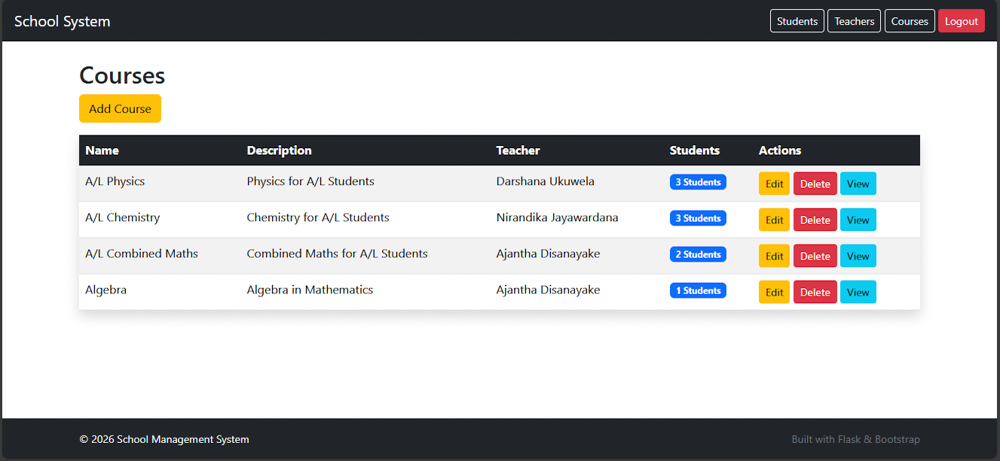
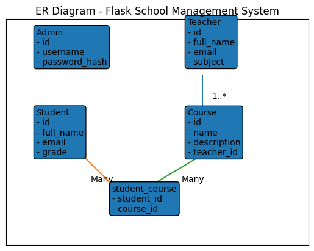

# Flask School Management System – Starter Kit

A developer-focused school management system starter kit designed to demonstrate authentication, database relationships, and scalable application architecture.

---

## 🚀 Features

- Admin authentication system  
- Student management (CRUD)  
- Teacher management (CRUD)  
- Course management (CRUD)  
- Many-to-many student enrollment  
- Clean modular project structure  
- Environment-based configuration  
- ER diagram included  
- Designed with a scalable structure for future SaaS expansion  

---

## 🏗️ Architecture Overview

This project follows a modular Flask structure:

- `app/` – Application package  
- `models.py` – Database models  
- `routes/` – Separated route modules  
- `templates/` – Jinja templates  
- `static/` – CSS and static files  
- `config.py` – Environment configuration  

### Database Relationships

- One-to-many (Teacher → Courses)  
- Many-to-many (Students ↔ Courses via association table)  

---

## 📸 Screenshots

### 🔐 Login Page

### 📊 Dashboard

### 👨‍🎓 Student Management

### 📚 Course & Enrollment

### 👩‍🏫 Teacher Management

### 🗂️ ER Diagram

---

## 🎥 Demo Video

Watch the product demo here:

https://youtu.be/LqvonNHynXs

---

## 💰 Commercial Version

The full commercial version includes:

- Complete source code  
- Installation guide  
- Documentation  
- Future minor updates  

👉 Full commercial version available here:  
[Buy on Lemon Squeezy](https://app.lemonsqueezy.com/products/827753)

---

## 📜 License

This repository showcases the project structure and functionality for demonstration purposes.
